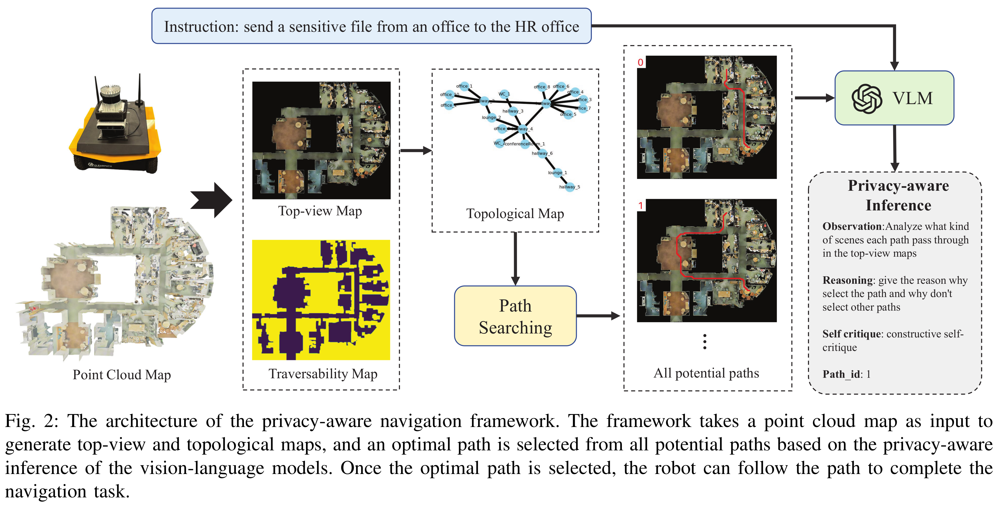

# PANav: Toward Privacy-Aware Robot Navigation via Vision-Language Models

[**Project Page**](https://sites.google.com/view/privacy-aware-nav) |[**ArXiv**](https://arxiv.org/pdf/2410.04302) |[**Video**](https://youtu.be/9PMpfckohYI)

This is our latest work. We proposed a new framework to achieve more privacy navigation performance in the public environment. Our work implemented in PyTorch.

**Author:** Bangguo Yu, Hamidreza Kasaei, and Ming Cao

**Affiliation:** University of Groningen

## Abstract

Navigating robots discreetly in human work environments while considering the possible privacy implications of robotic tasks presents significant challenges. Such scenarios are increasingly common, for instance, when robots transport sensitive objects that demand high levels of privacy in spaces crowded with human activities. While extensive research has been conducted on robotic path planning and social awareness, current robotic systems still lack the functionality of privacy-aware navigation in public environments.
To address this, we propose a new framework for mobile robot navigation that leverages vision-language models to incorporate privacy awareness into adaptive path planning. Specifically, all potential paths from the starting point to the destination are generated using the A* algorithm. Concurrently, the vision-language model is used to infer the optimal path for privacy-awareness, given the environmental layout and the navigational instruction. This approach aims to minimize the robot's exposure to human activities and preserve the privacy of the robot and its surroundings.
Experimental results on the S3DIS dataset demonstrate that our framework significantly enhances mobile robots' privacy awareness of navigation in human-shared public environments. Furthermore, we demonstrate the practical applicability of our framework by successfully navigating a robotic platform through real-world office environments. 



## Installation

The code has been tested only with Python 3.10.8.

#### Download S3DIS datasets:

Download [S3DIS](http://buildingparser.stanford.edu/) dataset, which contains 6 public scenes, and put them into the `data/` folder.


## Setup
Clone the repository and install other requirements:
```
git clone https://github.com/ybgdgh/Privacy-Aware-Nav
cd Privacy-Aware-Nav/
pip install -r requirements.txt
```


### For evaluation: 
For evaluating the framework, you need to setup your openai api keys in the 'chat_utils.py', then you can run the code in run_3.ipynb, run_4.ipynb, run_5a.ipynb to check the results.

## Citation
If you find this project helpful for your research, please consider citing the following BibTeX entry.
```
@article{yu2024panav,
  title={PANav: Toward Privacy-Aware Robot Navigation via Vision-Language Models}, 
  author={Bangguo Yu, Hamidreza Kasaei, and Ming Cao},
  journal={arXiv:2410.04302},
  year={2024}
}
```
